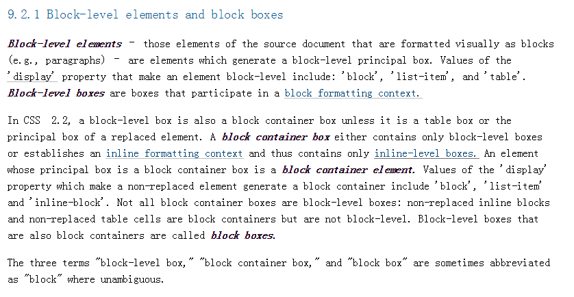

css 2.2 规范
===
---
_前言：翻译了一下 css2.2 中的 8-10 章_

9 视觉格式化模型

9.1 介绍视觉格式化模型

这一章和下一章描述视觉格式化模型：用户代理图和处理文档树和可视化媒体

在视觉格式化模型中，每个文档树中的元素会根据盒模型生成一个或多个盒子。
盒子的排布按照如下规则：

* 盒子的尺寸和类型
* 定位方案(正常流、浮动、和绝对定位)
* 在文档树中元素之间的关系
* 外部信息(视图尺寸、属于图片的固有尺寸等等)

这一章和下一章的多有内用都适用于流式媒体和页媒体，但是对于页媒体外边距的使用有差异。

9.1 视图
视图就是浏览器显示文档的窗口，

9.1.2 包含块
包含块就是父元素

9.2 控制盒子的产生
盒子的类型会影响它的视觉格式化模型。决定类型的因素
1. display 属性
2. 若未定义依照元素类型来继承

9.2.1 块水平的元素和块级盒  
1. 块元素产生块级盒 
2. 块级盒按照块格式化进行布局

9.2.2 包含块
1. 只包含块级盒的包含块参与块格式化布局  
2. 只包含行内包含块参与行内格式化布局

块级别盒只是最基本的块级单元
块容器盒

块容器元素->块容器盒

块元素->块容器盒->块盒(可以包含别的盒子)

块级别盒
