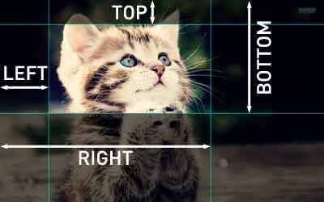

---
title:attrb    
tag:attrb      
birth:2016-11-23      
modified:2016-11-23      
---

attrb
===
**前言:讲解 css 中难于理解的属性**

---

# 属性概览

# 属性详解
## clip
clip 属性用来裁剪图像，参数含义如下:

`clip: rect(<top>, <right>, <bottom>, <left>)`

## box-shadow

