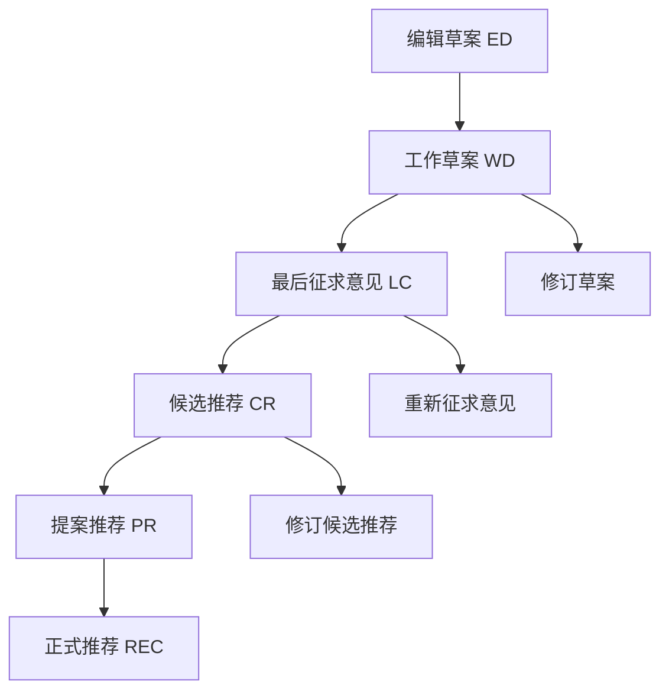

# CSS 标准与规范

## CSS 规范发展历史

### 规范版本演进

| 版本 | 发布时间 | 主要特性 |
|------|----------|----------|
| **CSS1** | 1996年 | 基础样式、字体、颜色、盒模型 |
| **CSS2** | 1998年 | 定位、浮动、媒体类型、表格布局 |
| **CSS2.1** | 2011年 | CSS2的修订版，修复错误和澄清 |
| **CSS3** | 2011年至今 | 模块化发展，动画、变换、Flexbox等 |
| **CSS4** | 规划中 | 选择器增强、容器查询等 |

### CSS3 模块化发展

CSS3 采用模块化开发方式，不同模块独立发展：

| 模块 | 状态 | 主要功能 |
|------|------|----------|
| **选择器 Level 3** | 推荐标准 | 属性选择器、伪类增强 |
| **颜色模块 Level 3** | 推荐标准 | HSL、RGBA、opacity |
| **文本模块 Level 3** | 工作草案 | text-shadow、word-wrap |
| **背景和边框** | 候选推荐 | border-radius、box-shadow |
| **弹性盒子布局** | 推荐标准 | Flexbox |
| **网格布局** | 推荐标准 | CSS Grid |
| **动画** | 工作草案 | animation、@keyframes |
| **变换** | 工作草案 | transform、transform-origin |

## W3C 规范制定过程

### 规范状态和推荐过程



#### 1. Working Draft (工作草案)
- **状态**：草案阶段，被接受为CSS组成部分
- **特点**：社区评审中，可能频繁变更
- **标识**：文档标题包含"Working Draft"

#### 2. Last Call (最后征求意见)
- **状态**：工作草案发展到下一阶段前的最终审核
- **特点**：代表文档审核周期即将结束
- **目的**：收集最后的意见和反馈

#### 3. Candidate Recommendation (候选推荐)
- **状态**：草案审核通过后的阶段
- **特点**：浏览器厂商开始实现文档中的属性
- **目的**：收集现实世界的实现反馈

#### 4. Proposed Recommendation (提案推荐)
- **条件**：两个或多个浏览器以相同方式实现
- **要求**：没有抛出严重的技术问题
- **状态**：准备提交W3C顾问委员会审批

#### 5. Recommendation (正式推荐)
- **状态**：被W3C顾问委员会批准通过
- **意义**：成为正式的Web标准
- **稳定性**：不再有重大变更

> **重要说明**：推荐过程与浏览器实现过程并不总是以相同的方式运作。浏览器可能在规范正式推荐之前就开始实现某些特性。

## CSS2.2 视觉格式化模型

### 9.1 视觉格式化模型介绍

在视觉格式化模型中，每个文档树中的元素会根据盒模型生成一个或多个盒子。盒子的排布按照如下规则：

1. **盒子的尺寸和类型**
2. **定位方案**（正常流、浮动、和绝对定位）
3. **文档树中元素之间的关系**
4. **外部信息**（视口尺寸、图片的固有尺寸等）

### 9.1.1 视口 (Viewport)

**视口**就是浏览器显示文档的窗口区域。

```css
/* 视口相关单位 */
.full-height {
  height: 100vh; /* 视口高度 */
}

.full-width {
  width: 100vw; /* 视口宽度 */
}

/* 视口元信息 */
/* HTML: <meta name="viewport" content="width=device-width, initial-scale=1"> */
```

### 9.1.2 包含块 (Containing Block)

**包含块**是元素定位和尺寸计算的参考框架：

```css
/* 根元素的包含块是视口 */
html {
  /* 包含块：视口 */
}

/* 静态定位元素的包含块是最近的块级祖先元素 */
.parent {
  /* 子元素的包含块 */
}

/* 绝对定位元素的包含块是最近的定位祖先元素 */
.positioned-parent {
  position: relative; /* 创建包含块 */
}

.absolute-child {
  position: absolute;
  /* 包含块：.positioned-parent */
}
```

### 9.2 控制盒子的生成

#### 9.2.1 块级元素和块级盒

```css
/* 块级元素产生块级盒 */
div, p, h1, section {
  display: block; /* 默认 */
}

/* 块级盒按照块格式化上下文进行布局 */
.block-container {
  /* 建立块格式化上下文 */
}
```

#### 9.2.2 行内元素和行内盒

```css
/* 行内元素产生行内盒 */
span, a, strong, em {
  display: inline; /* 默认 */
}

/* 行内盒按照行内格式化上下文进行布局 */
.inline-container {
  /* 包含行内盒 */
}
```

#### 9.2.3 块容器盒

```css
/* 块容器可以包含其他盒子 */
.block-container {
  /* 可以包含块级盒或建立行内格式化上下文 */
}

/* 同时是块级盒和块容器的元素称为块盒 */
.block-box {
  display: block;
  /* 既是块级盒，也是块容器 */
}
```

## 浏览器实现与兼容性

### 主流浏览器支持

| 浏览器 | 内核 | CSS支持特点 |
|--------|------|-------------|
| **Chrome** | Blink | 快速支持新特性，实验性功能 |
| **Firefox** | Gecko | 标准兼容性好，渐进实现 |
| **Safari** | WebKit | iOS兼容，webkit前缀 |
| **Edge** | Blink | 现代标准支持良好 |
| **IE** | Trident | 旧版本兼容性问题 |

### 厂商前缀

```css
/* 需要厂商前缀的示例 */
.experimental {
  -webkit-transform: rotate(45deg); /* Safari, Chrome */
  -moz-transform: rotate(45deg);    /* Firefox */
  -ms-transform: rotate(45deg);     /* IE */
  -o-transform: rotate(45deg);      /* Opera */
  transform: rotate(45deg);         /* 标准语法 */
}

/* 现代写法（使用Autoprefixer等工具自动添加） */
.modern {
  transform: rotate(45deg);
}
```

### 特性检测

#### CSS @supports 规则

```css
/* 检测CSS特性支持 */
@supports (display: grid) {
  .grid-container {
    display: grid;
    grid-template-columns: repeat(3, 1fr);
  }
}

@supports not (display: grid) {
  .grid-container {
    display: flex;
    flex-wrap: wrap;
  }
}

/* 复杂条件检测 */
@supports (display: flex) and (align-items: center) {
  .flex-center {
    display: flex;
    align-items: center;
    justify-content: center;
  }
}
```

#### JavaScript 特性检测

```javascript
// 检测CSS属性支持
function supportsCSSProperty(property, value) {
  const element = document.createElement('div');
  element.style[property] = value;
  return element.style[property] === value;
}

// 使用示例
if (supportsCSSProperty('display', 'grid')) {
  document.body.classList.add('supports-grid');
}

// 检测CSS选择器支持
function supportsCSSSelector(selector) {
  try {
    document.querySelector(selector);
    return true;
  } catch (e) {
    return false;
  }
}
```

## CSS 解析和优先级

### 选择器优先级计算

```css
/* 优先级计算：内联样式(1000) > ID(100) > 类(10) > 元素(1) */

/* 优先级：1 */
p { color: black; }

/* 优先级：10 */
.text { color: blue; }

/* 优先级：100 */
#title { color: red; }

/* 优先级：110 (100 + 10) */
#title.highlight { color: green; }

/* 优先级：1000 */
/* <p style="color: yellow;">内联样式</p> */

/* !important 覆盖 */
.important { color: purple !important; }
```

### 层叠顺序

```css
/* 层叠顺序（从低到高）：
   1. 用户代理样式表
   2. 用户样式表
   3. 作者样式表
   4. 作者!important声明
   5. 用户!important声明
   6. 用户代理!important声明
*/

/* 源码顺序也影响层叠 */
.first { color: red; }
.second { color: blue; } /* 如果优先级相同，后者生效 */
```

## 渲染引擎处理过程

### 1. HTML解析构建DOM树

```html
<!DOCTYPE html>
<html>
<head>
  <style>
    .container { display: flex; }
    .item { flex: 1; }
  </style>
</head>
<body>
  <div class="container">
    <div class="item">Item 1</div>
    <div class="item">Item 2</div>
  </div>
</body>
</html>
```

### 2. CSS解析构建CSSOM树

```javascript
// 简化的CSSOM结构
const cssomTree = {
  '.container': {
    display: 'flex'
  },
  '.item': {
    flex: '1'
  }
};
```

### 3. 合并构建渲染树

```javascript
// 渲染树结合DOM和CSSOM
const renderTree = [
  {
    node: 'div.container',
    styles: { display: 'flex' },
    children: [
      {
        node: 'div.item',
        styles: { flex: '1' },
        text: 'Item 1'
      },
      {
        node: 'div.item', 
        styles: { flex: '1' },
        text: 'Item 2'
      }
    ]
  }
];
```

### 4. 布局计算

```css
/* 布局阶段计算元素的几何信息 */
.container {
  width: 1000px; /* 父容器宽度 */
  display: flex;
}

.item {
  flex: 1; /* 每个item宽度 = 1000px / 2 = 500px */
}
```

### 5. 绘制渲染

```css
/* 绘制阶段处理视觉样式 */
.item {
  background: #f0f0f0;
  border: 1px solid #ccc;
  color: #333;
  /* 这些属性在绘制阶段处理 */
}
```

## 现代CSS特性

### CSS 容器查询

```css
/* 基于容器尺寸的查询（即将到来） */
.card-container {
  container-type: inline-size;
}

@container (min-width: 400px) {
  .card {
    display: grid;
    grid-template-columns: 1fr 1fr;
  }
}
```

### CSS 自定义属性 (CSS变量)

```css
:root {
  --primary-color: #007bff;
  --font-size-base: 16px;
  --spacing-unit: 8px;
}

.component {
  color: var(--primary-color);
  font-size: var(--font-size-base);
  padding: calc(var(--spacing-unit) * 2);
}
```

### CSS Houdini

```javascript
// Paint API 示例
class MyPainter {
  paint(ctx, geom, properties) {
    // 自定义绘制逻辑
    ctx.fillStyle = '#f0f0f0';
    ctx.fillRect(0, 0, geom.width, geom.height);
  }
}

registerPaint('my-painter', MyPainter);
```

```css
.custom-paint {
  background: paint(my-painter);
}
```

## 学习资源和工具

### 官方规范文档

- [CSS 规范首页 - W3C](https://www.w3.org/Style/CSS/)
- [CSS2.2 规范](https://www.w3.org/TR/CSS22/)
- [CSS3 模块列表](https://www.w3.org/Style/CSS/current-work)
- [CSS4 选择器规范](https://www.w3.org/TR/selectors-4/)

### 实用工具

- **Can I Use**: 检查浏览器支持情况
- **MDN Web Docs**: 详细的属性文档和示例
- **CSS Validator**: W3C官方CSS验证工具
- **Autoprefixer**: 自动添加厂商前缀

### 规范跟踪

```javascript
// 跟踪CSS新特性的方法
const trackNewFeatures = {
  resources: [
    'https://www.w3.org/TR/', // W3C技术报告
    'https://caniuse.com/',   // 浏览器支持
    'https://chromestatus.com/', // Chrome特性状态
    'https://webkit.org/status/' // WebKit特性状态
  ]
};
```

## 最佳实践

### 1. 渐进增强

```css
/* 基础样式 */
.button {
  padding: 10px 20px;
  border: 1px solid #ccc;
  background: #f5f5f5;
}

/* 现代浏览器增强 */
@supports (display: flex) {
  .button {
    display: flex;
    align-items: center;
    justify-content: center;
  }
}
```

### 2. 优雅降级

```css
/* 现代特性 */
.grid-container {
  display: grid;
  grid-template-columns: repeat(auto-fit, minmax(250px, 1fr));
  gap: 20px;
}

/* 回退方案 */
@supports not (display: grid) {
  .grid-container {
    display: flex;
    flex-wrap: wrap;
  }
  
  .grid-item {
    flex: 1 1 250px;
    margin: 10px;
  }
}
```

### 3. 标准优先

```css
/* 推荐：使用标准语法 */
.transform {
  transform: rotate(45deg);
}

/* 避免：过度依赖厂商前缀 */
.old-style {
  -webkit-transform: rotate(45deg);
  -moz-transform: rotate(45deg);
  transform: rotate(45deg);
}
```

## 参考资料

- [CSS 规范 - W3C](https://www.w3.org/Style/CSS/)
- [CSS2.2 规范 - W3C](https://www.w3.org/TR/CSS22/)
- [CSS 工作组 - W3C](https://www.w3.org/Style/CSS/members)
- [Web 标准项目](https://www.webstandards.org/) 