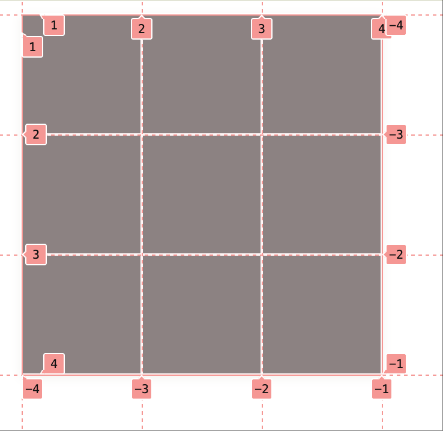

Grid 用来实现二维布局。它允许开发者通过定义行和列来创建复杂的布局结构。通过本章学习达到以下目标

- 理解 Grid 布局的核心概念和常用属性
- 能够用 Grid 实现常见的布局模式

## 概念模型

想象一下现在你在给家里装修，需要铺瓷砖。

### 网格容器(Grid Container)

在铺瓷砖之前你需要确保地面平整，这个平整的地面就是网格容器，决定了你后续如何放置瓷砖。
你可以通过 `display: grid` 设置元素为网格容器。

{/* @playground id="concept-grid-container" mode="demo" */}

### 网格线(Grid Lines)

在开始铺瓷砖之前，你需要确定瓷砖的尺寸，在地面上划分出一条条网格线。
这些网格线就像是瓷砖的边界，在装修中叫弹线，帮助你确定每块瓷砖的位置。在 CSS Grid 中。
网格线是通过 `grid-template-columns` 和 `grid-template-rows` 来定义的。

{/* @playground id="concept-grid-lines" mode="demo" */}

图中每条白色的线就是网格线，它们将地面划分成了一个个小方格。

#### 网格线编号

为了方便定位和对齐，网格线有编号。

- 从左到右为列网格线，分别为 1, 2, 3, 4
- 从上到下为行网格线，分别为 1, 2, 3, 4

此外有的时候我们会倒着数，比如倒数第一列、第二列、第三列、第四列。此时

- 从右到左为列网格线，分别为 -1, -2, -3, -4， 表示倒数第 n 列
- 从下到上为行网格线，分别为 -1, -2, -3, -4， 表示倒数第 n 行

### 网格轨道(Grid Tracks)

两条网格线之间的空间称为网格轨道。比如上图列

- 1 和 2 列之间的空间就是第一列的网格轨道。类似于铺瓷砖的时候纵向铺了一列
- 1 和 2 行之间的空间就是第一行的网格轨道。类似于铺瓷砖的时候横向铺了一行。

### 网格单元格(Grid Cell)

每一个网格轨道之间的交叉区域称为网格单元格。它是网格布局中最小的单位。等效于瓷砖的实际铺设区域。

{/* @playground id="concept-grid-cell" mode="demo" */}

### 网格区域(Grid Area)

多个网格单元格组成的区域称为网格区域。它必须是一个矩形区域。例如你在实际铺瓷砖时，可能会选择在某个区域铺设一块大理石瓷砖，
这个大理石瓷砖可能占据多个网格单元格。这就叫做一个网格区域。

你可以通过

- **grid-column** 定义网格区域的起始和结束列
- **grid-row** 定义网格区域的起始和结束行

{/* @playground id="concept-grid-area" mode="demo" */}

### 网格间距(Grid Gap)

在铺瓷砖时，你可能会留出一些间距来让瓷砖更美观，方便你后续做美缝或者其他处理。
在 CSS Grid 中，可以通过 `grid-gap` 属性来设置网格行和列之间间距。

{/* @playground id="concept-grid-gap" mode="demo" */}

图中黄色线条就是网格间距，它将每个瓷砖之间留出了一定的空间。

### 小结

| 概念                         | 描述                                                                                                  | 类比模型           |
| ---------------------------- | ----------------------------------------------------------------------------------------------------- | ------------------ |
| **网格容器(Grid Container)** | 定义网格布局的元素                                                                                    | 平整的地面         |
| **网格线(Grid Lines)**       | 划分网格的线条，默认从左到右、从上到下, 序号从 1 开始递增, 倒着数从右往左, 从下到上序号从 -1 开始递增 | 瓷砖铺排线(弹线)   |
| **网格轨道(Grid Tracks)**    | 任意两条平行的网格线之间的空间                                                                        | 瓷砖的实际铺设区域 |
| **网格单元格(Grid Cells)**   | 网格最小的空间单元                                                                                    | 瓷砖的实际铺设区域 |
| **网格区域(Grid Areas)**     | 有多个网格单元组成的空间,**注意空间只能为矩形**                                                       | 瓷砖的实际铺设区域 |
| **网格间距(Grid Gaps)**      | 利用 grid-gap 属性申明网格行和列的间距                                                                | 瓷砖之间的缝隙     |

## grid 容器设置

### display grid

通过将 `display` 属性设置为 `grid` 或 `inline-grid` 创建网格布局。
网格中的元素每个会单独占用一列，形成一列多行的网格节奏。

默认创建 1\*n 的网格容器,每行高度由内容区决定,每个网格单元会自动换行，即使宽度不足一行。
查看示例

{/* @playground id="display" mode="demo" */}

display grid 和 inline-grid 的核心区别

- `grid` 子项默认占满一行，而 `inline-grid` 子项只占用内容宽度
- `grid` 生成的容器是块级元素独占一行，而 `inline-grid` 生成的容器是内联元素随着行内其他元素铺排

设置父元素 `display` 属性为

- `grid` 生成网格块容器
- `inline-grid` 生成内联网格容器

可以类比 `block` 和 `inline-block`。

此时生成的容器为单列,每行高度由内容区决定,布局效果和正常 div 容器相同。

可以为容器设置行列属性来定义网格系统

### grid-template-rows/columns

为了实现多行多列的布局，网格提供了

- **grid-template-rows** 定义网格行的宽度和行数
- **grid-template-columns** 定义网格列的宽度和列数

实现一个 2 行 2 列布局

{/* @playground id="grid-columns-rows" mode="demo" */}

#### fr

fr 是用于分配网格容器剩余空间宽度的单位，效果类似 flex

{/* @playground id="fr" mode="demo" */}

注意 fr 的和不足 1 的时候，与存在剩余未分配空间

{/* @playground id="fr-percent" mode="demo" */}

#### minmax/auto

可以混合多种不同的单位来定义列和行的大小。除了常规的设定像素,百分比手段来定义网格行列轨道的宽度。
grid 提供丰富的手段来定义轨道宽度。典型值如下

1. **auto** 除了定义特定的宽度可以采用 `auto` 关键字,表示最大化对应列
1. 若父容器定宽,则列宽度取决于该列宽度最长的子元素
1. 若父容器不定宽,则在包含子元素的基础上划分父元素空间

1. **minmax** 设置一个区间来定义行列轨道宽度
1. `minmax(100px,1fr)` 表示最小为 100px,最大根据容器剩余空间进行划分

{/* @playground id="grid-value-minmax-auto" mode="demo" */}

#### repeat

可以利用 repeat 函数简化重复定义

{/* @playground id="grid-columns-rows-repeat" mode="demo" */}

函数接受两个参数，repeat(count, track)

- count: 重复次数
- track: 定义轨道的宽度, 注意 track 可以包含多个值表示模式重复

{/* @playground id="grid-columns-rows-repeat-track" mode="demo" */}

##### auto-fill

有时你不知道具体需要多少列或行，可以使用 `auto-fill` 或 `auto-fit` 来自动填充网格。

使用 auto-fill 每列宽度 100px, 创建多列

{/* @playground id="grid-columns-rows-auto-fill" mode="demo" */}

auto-fill 可以配合 `minmax` 函数使用

{/* @playground id="grid-columns-rows-auto-fill-func" mode="demo" */}

##### auto-fit

auto-fit 和 auto-fill 类似，但会自动适应容器宽度，填充剩余空间。

{/* @playground id="grid-columns-rows-auto-fit" mode="demo" */}

### grid-auto-flow

默认网格元素按照从左往右、从上往下的顺序排列。可以通过 `grid-auto-flow` 设置为 `column` 来改变排列方向。
按照列来铺排

{/* @playground id="grid-auto-flow" mode="demo" */}

#### dense

grid-auto-flow 支持 `dense` 选项，该选项会改变自动放置项目的方式，使其尽可能填补空缺。

{/* @playground id="grid-auto-flow-dense" mode="demo" */}

### grid-gap

可以通过 `grid-gap` 属性来定义网格行和列之间的间距。该属性是一个简写属性，等同于 `grid-row-gap` 和 `grid-column-gap`。

{/* @playground id="grid-gap" mode="demo" */}

### implicit grid

grid-template 只能定义有限行，对于超出的部分会创建隐式网格(implicit grid)。隐式网格会自动创建行和列来容纳额外的内容。

- 行默认为实际内容高度
- 列遵从定义的网格列宽度

{/* @playground id="implicit-grid" mode="demo" */}

> 注意网格线的序号只针对显式网格有效，特别是负值只针对显式网格线。
> 隐式网格线的会在显示网格线基础上自增

{/* @playground id="implicit-grid-number" mode="demo" */}

示例中

1. `-1` 表示显示网格的最后一条线，而非 grid 的列末尾
2. `6` 若设置列数超出显示网格线，会自动创建隐式网格线，隐式网格线会基于定义的序号自动均分多余空间

#### grid-auto-columns/rows

同 `grid-template-columns/rows` 设置显示网格线，可以通过 `grid-auto-columns/rows` 定义隐式网格线的行为

{/* @playground id="grid-auto-columns" mode="demo" */}

隐式网格网格线同样支持像 `fr`、`minmax()`、`auto` 等复杂的轨道尺寸设置，浏览器会基于模式设置重复后续的隐式网格线, **注意不能使用 `repeat()` 函数**。

{/* @playground id="grid-auto-pattern" mode="demo" */}

### 具名网格线

除了使用数字来定义网格线，还可以使用具名轨道来更直观地定义网格区域。通过在每个轨道前使用
`[startName endName]` 的语法来定义具名轨道。注意每个轨道实际上可以起两个名字，因为网格线放大实际上可以理解为有左右两条边，可以类比为田地中的田垄，田垄本身是一条网格线，但是田垄有左右两条边

{/* @playground id="grid-named-line" mode="demo" */}

### grid-template-areas

为了简化采用坐标轴定义各网格，在网格容器上可以使用 `grid-template-areas` 属性来定义网格区域。后续会讲解 grid-area 的使用

{/* @playground id="grid-template-areas" mode="demo" */}

### grid-template

grid-template 属性是一个简写属性，可以同时定义网格行、列和区域。它可以包含以下属性

{/* @playground id="grid-template" mode="demo" */}

一个更复杂的简写示例，同时包含具名 grid 定义

{/* @playground id="grid-template-complex" mode="demo" */}

### subgrid

subgrid 是 CSS Grid 的一个新特性，允许子网格继承父网格的行和列定义。

{/* TODO: 优化示例来说明 subgrid 真实场景 */}

{/* @playground id="subgrid-basic" mode="demo" */}

通过在子网格上设置 `grid-template-columns` 或 `grid-template-rows` 为 `subgrid`，可以使子网格的行和列与父网格对齐。

{/* @playground id="subgrid" mode="demo" */}

### grid 容器属性总结

| 属性                    | 描述                     |
| ----------------------- | ------------------------ |
| `display: grid`         | 创建网格容器             |
| `grid-template-columns` | 定义网格列的宽度和数量   |
| `grid-template-rows`    | 定义网格行的高度和数量   |
| `grid-template-areas`   | 定义网格区域的名称       |
| `grid-auto-flow`        | 定义自动放置项目的方式   |
| `grid-gap`              | 定义网格行和列之间的间距 |
| `grid-auto-columns`     | 定义隐式网格列的宽度     |
| `grid-auto-rows`        | 定义隐式网格行的高度     |
| `grid-template`         | 同时定义网格行、列和区域 |

## grid 元素设置

### grid-column-start/end

可以通过 `grid-column-start` 和 `grid-column-end` 属性来定义网格项目在网格中的位置。

设置元素从第 2 条网格线开始排列。

{/* @playground id="grid-column-start" mode="demo" */}

网格线从 1 开始编号，负数表示从右往左的网格线。

{/* @playground id="grid-column-start-negative" mode="demo" */}

#### span

类似表格 span ，用于定义 grid 项目占据几条轨道

{/* @playground id="span" mode="demo" */}

#### auto

auto 表示默认铺排对应的位置，比如上例 span 等效为如下语法

{/* @playground id="auto" mode="demo" */}

### grid-column/grid-row

可以通过 `grid-column` 和 `grid-row` 属性来定义网格项目在网格中的位置。
以典型的圣杯布局为例

{/* @playground id="grid-holy" mode="demo" */}

- grid column 表示列网格线，从左到右依次为 1,... n， 反向为 -1, -2, ... -n
- grid row 表示行网格线，从上到下依次为 1,... n， 反向为 -1, -2, ... -n

未指定时，grid 项目会自动占据一个网格单元格。通过制定行类的网格区域，使元素跨越多个网格
效果类似表格中的 `colspan` 和 `rowspan` 属性。

### grid-area

- 在网格项目上可以使用 `grid-area` 属性来指定该项目所在的网格区域。

{/* @playground id="grid-areas-holy" mode="demo" */}

## grid 对齐

类似 flex 对齐

### justify-content/align-content

设置网格项目的分布方式

- `justify-content` 类似 flex 控制网格元素在水平方向的对齐方式
- `align-content` 类似 flex 控制网格元素在垂直方向的

{/* @playground id="justify-content" mode="demo" */}

### justify-items/align-items

设置每个网格项目在单元格内的对齐方式。

{/* @playground id="justify-items" mode="demo" */}

### justify-self/align-self

设置单个网格项目在单元格内的对齐方式。可以覆盖 `justify-items` 和 `align-items` 的设置。

{/* @playground id="justify-self" mode="demo" */}

## debug

chrome 提供了丰富的能力调试 grid , 参考 [调试 grid](https://developer.chrome.com/docs/devtools/css/grid)

## 知识点

- **CSS Grid 容器**
  - `display: grid、 inline-grid` 将元素设为网格容器，为其直接子元素创建网格格式上下文。
  - `grid-template-columns`/`grid-template-rows` 定义网格轨道，轨道尺寸
    - `fr` 单位：分配剩余空间
    - `px`/`em`/`%` 等：固定长度
    - `auto`：根据内容自动计算
    - `min-content、max-content`：定义最小和最大值
    - `minmax(min, max)`：定义最小和最大值
    - `fit-content()`：根据内容适配宽度
    - `auto-fill、auto-fit` 自动填充或适配网格
    - `repeat(num, pattern)` 简化重复定义
- **显式网格定义**：属性 定义网格的列/行轨道（可包含具体长度、`fr`、`minmax()`、`auto` 等）【概念性】，制定网格的结构。
- **隐式网格与自动轨道**：未显式定义的行/列轨道会自动创建，可用 `grid-auto-columns`/`grid-auto-rows` 调整其大小【概念性】。
- **网格单元格与网格线**：网格由交叉的行线与列线构成最小的“单元格”（**格子**）【事实性】，可使用行/列编号对齐或跨越。
- **网格间距（Gap）**：属性 `gap`（或 `column-gap`、`row-gap`）设定列间距与行间距【程序性】，简化设置网格间隙。
- **自动布局方向**：`grid-auto-flow` 控制自动放置项目时沿行还是列填充（默认沿行）【概念性】；可设为 `dense` 来填补空缺。
- **项目放置（定位）**：网格子项通过 `grid-column-start`/`grid-column-end` 和 `grid-row-start`/`grid-row-end` 指定起始和结束线【程序性】；简写 `grid-column`/`grid-row` 也可使用。
- **跨越（Span）**：可在 `*-end` 或简写中使用 `span n`，使网格项跨越多个轨道【程序性】。例如 `grid-column: auto / span 2`。
- **对齐属性**：容器层面 `justify-items`/`align-items` 设定项目在单元格内的默认对齐方式【概念性】；而 `justify-content`/`align-content` 控制整个网格的对齐与分布【概念性】。子项层面可用 `justify-self`/`align-self` 覆盖。
- **显式 vs 隐式网格**：显式网格是开发者定义的轨道集合（通过 `grid-template-...`），隐式网格是浏览器自动添加的轨道【概念性】；使用负编号（如 `grid-column: 1 / -1`）仅作用于显式网格。
- **常见应用**：网格适用于二维布局，比如同时控制多行多列；理解 `fr` 单位、自动放置和对齐逻辑是高效使用网格的关键【元认知】。在设计布局前先规划网格结构，有助于更快地完成复杂布局。

{/* @playground id="grid-concept" mode="demo" */}

## 参考资料

- [grid example](https://gridbyexample.com/examples/)
- [MDN grid](https://developer.mozilla.org/zh-CN/docs/Web/CSS/CSS_grid_layout)
- [CSS Tricks grid](https://css-tricks.com/snippets/css/complete-guide-grid/)
